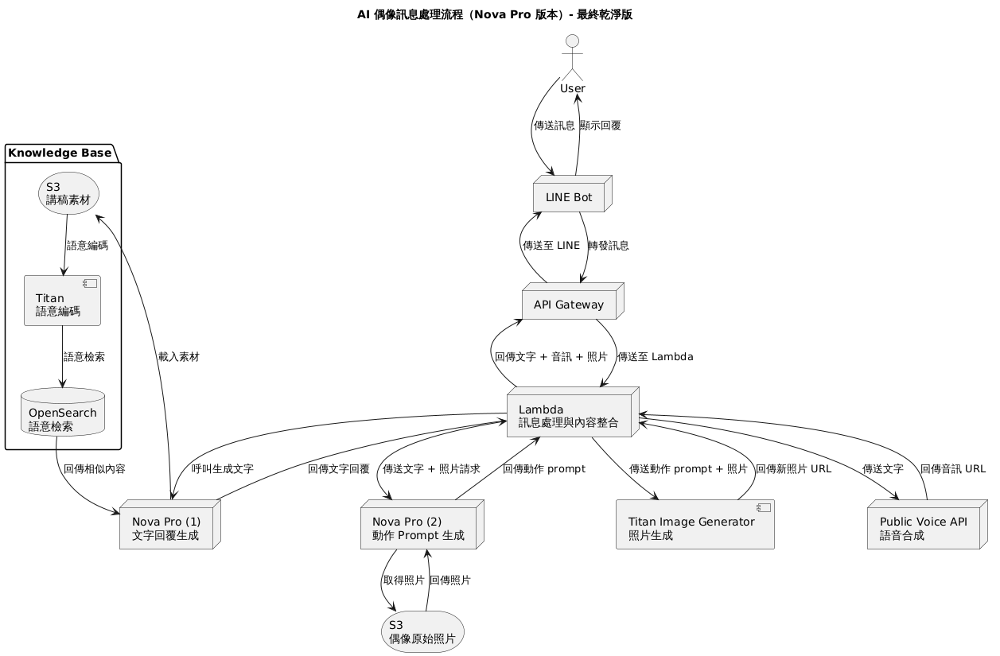

# AWS-HACKTHON, 眾量橘

## Description


## System Architecture


## External Packages
Public Voice API
- Documentation: [PublicVoiceAPI-FEniX.pdf](https://reurl.cc/4L1MEK)
- Response Examples:
  - mode=stream:
    ```json
    {
      "message": "success",
      "media_url": "https://cdn.data.gamania.com/persona-sound/20241014/ting/05870db4-6b07-48a0-b7f0-3ed69e137989.wav"
    }
    ```
  - mode=file: Binary file content


## DataFlow：AI 偶像訊息處理流程


1. 使用者 → LINE 傳送訊息  
2. LINE → API Gateway  
3. API Gateway → Lambda
4. Lambda → Nova-Content 生成文字回覆  
5. Lambda → 呼叫 Public Voice API 進行語音合成  
6. Lambda → 回傳「文字 + 音訊 URL」給 API Gateway → LINE → 用戶收到語音訊息

1. 使用者 → LINE 傳送訊息
2. LINE → API Gateway
3. API Gateway → Lambda
4. Lambda → Nova Pro (1) → Knowledge Base 查詢素材（S3 → Titan → OpenSearch → 回傳）→ Nova Pro (1)
5. Nova Pro (1) 生成文字回覆 → Lambda
6. Lambda → Public Voice API 進行語音合成
7. Lambda → Nova Pro (2) 請求動作 prompt（提供文字回覆 + 原始照片）
8. Nova Pro (2) → 取得 S3 原始照片並產生動作 prompt
9. Lambda → Titan Image Generator 生成新偶像照片
10. Lambda → 整合「文字 + 音訊 URL + 照片 URL」
11. Lambda → API Gateway → LINE → 使用者收到完整互動回覆


